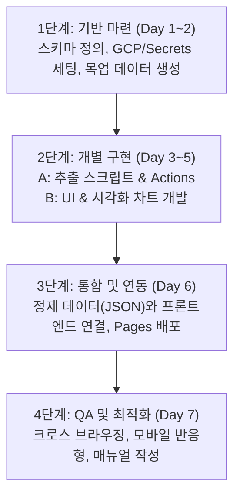

# 📋 3인 팀 역할 분담 및 협업 프로세스 (ROLES)

본 문서는 회계장부 웹 대시보드 프로젝트의 3인 업무 분담, 마일스톤 및 협업 규칙을 정의합니다.

---

## 1. 업무 분담 매트릭스 (RACI 매트릭스)

- **R (Responsible):** 실무 담당자
- **A (Accountable):** 최종 책임 및 의사결정자
- **C (Consulted):** 피드백/조언 제공자
- **I (Informed):** 결과 공유 대상자

| 업무 항목 | 팀원 A (파이프라인) | 팀원 B (프론트엔드) | 팀원 C (인프라/QA) |
| :--- | :---: | :---: | :---: |
| **구글 시트 데이터 스키마 정의** | C | C | **A / R** |
| **GCP 인증 & GitHub Secrets 설정** | C | I | **A / R** |
| **데이터 추출 & 전처리 스크립트** | **A / R** | C | I |
| **GitHub Actions 워크플로우 구성** | **A / R** | I | C |
| **대시보드 UI 컴포넌트 & 레이아웃 개발** | I | **A / R** | C |
| **차트 시각화 및 필터링 기능** | I | **A / R** | C |
| **GitHub Pages 배포 환경 세팅** | C | I | **A / R** |
| **통합 테스트 및 사용자 매뉴얼 작성** | C | C | **A / R** |

---

## 2. 개발 단계별 마일스톤

### 🗓️ 세부 일정 계획

1. **Phase 1: 기획 및 환경 설정 (Day 1 ~ Day 2)**
   - 팀원 C: 시트 열 구조 정의 및 Google Cloud Service Account 키 발급, 저장소 Secrets 등록
   - 팀원 B: 화면 와이어프레임 기획 및 `mock_data.json` 포맷 설계
   - 팀원 A: 개발 환경 세팅 (Python/Node.js 가상환경)
2. **Phase 2: 병렬 독립 개발 (Day 3 ~ Day 5)**
   - 팀원 A: Sheets API 연동 및 데이터 가공 스크립트 작성, Actions 워크플로우 초안
   - 팀원 B: `mock_data.json`을 바인딩하여 수입/지출 카드, 차트, 테이블 UI 제작
   - 팀원 C: 시트 입력 규칙(유효성 검사) 적용 및 GitHub Pages 기본 브랜치 환경 구성
3. **Phase 3: 연동 및 자동 배포 (Day 6)**
   - 실제 시트 데이터 추출 → 정제 JSON 생성 → Pages 자동 빌드 배포 통합 파이프라인 검증
4. **Phase 4: 검증 및 문서화 (Day 7)**
   - 실데이터 테스트, 모바일 UI 대응 검증, 사용 가이드 작성 완료

---

## 3. 협업 및 Git 워크플로우 규칙

1. **브랜치 전략 (Git Flow 축약형)**
   - `main`: 상용/배포 브랜치 (GitHub Pages 배포 타깃)
   - `feature/pipeline`: 팀원 A 작업 브랜치
   - `feature/frontend`: 팀원 B 작업 브랜치
   - `feature/infra-schema`: 팀원 C 작업 브랜치
2. **커밋 메시지 규칙 (Conventional Commits)**
   - `feat:` 새로운 기능 추가
   - `fix:` 버그 수정
   - `docs:` 문서 수정
   - `chore:` 빌드 업무 수정, 패키지 매니저 수정 등
3. **Pull Request (PR) 필수 조건**
   - 최소 1명 이상의 리뷰 및 승인(Approve) 후 `main`에 머지
   - Actions 실행 시 테스트/빌드 성공 확인
